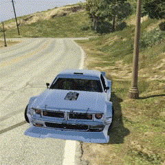
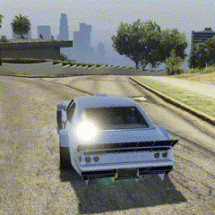
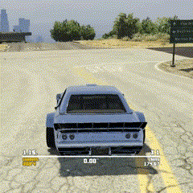
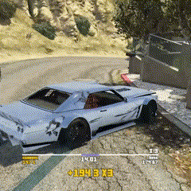

# BK98 Drift Script

This script is designed to provide drift mechanics and HUD indicators in games. It includes features such as angle calculation, scoring, multiplier effects, and HUD text display.

## Key Features
- **Stand-Alone**: The script can be run as a standalone script.
- **Angle Calculation**: Calculates the drift angle of a vehicle.
- **HUD Display**: Displays relevant information such as current angle, best record, and score on the screen.
- **Multiplier System**: Increases score based on certain thresholds.
- **Drift Initialization**: Automatically initializes drift recording when a player is in a vehicle and drifting.
- **Automated cancels**: Automatically cancels drift recording when a player stops drifting or well destroy vehicle.

## How It Works
1. **Angle Calculation**:
   - The script calculates the drift angle using the vehicle's velocity and rotation.
   

2. **HUD Display**:
   - HUD text is drawn at specified coordinates, showing various metrics like current angle, best record, score, and multiplier.

3. **Multiplier System**:
   - Multipliers are applied to scores based on predefined thresholds.
   

4. **Drift Initialization**:
   - The script continuously monitors the player's vehicle and initiates drift recording when appropriate.

5. **Automated Cancels**:
   - The script automatically cancels drift recording when a player stops drifting or well destroys the vehicle.
   - The script decreases the multiplier when player not drifting and when multiplier reaches zero cancels the recording.
   
   
   

## Configuration
- Constants:
    - font height
    - display indicator positions
    - multiplier thresholds